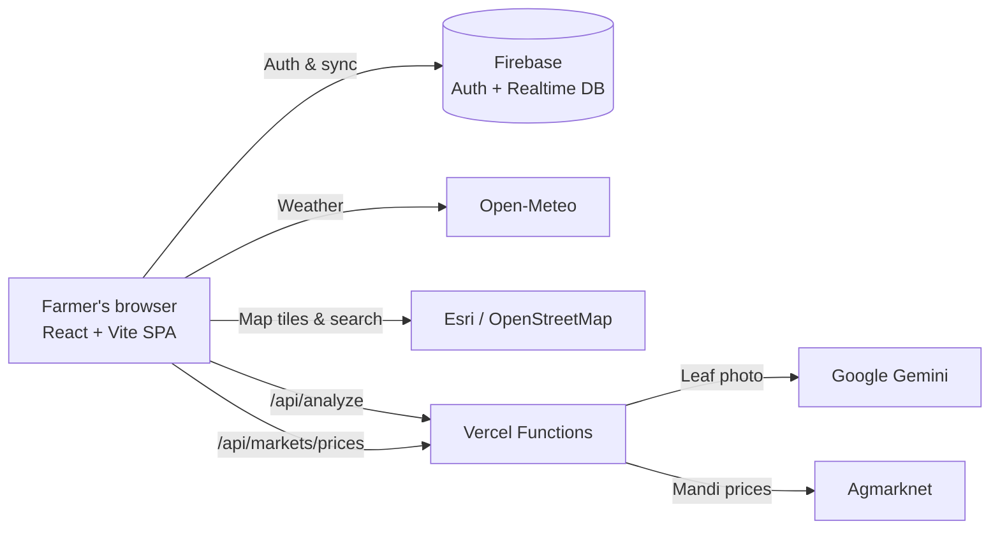

<div align="center">

# 🌾 FarmWise

### Smart, bilingual farm planning for Telangana & Andhra Pradesh farmers

**Map your field. Know your numbers. Act on time — in English or తెలుగు.**

[](https://react.dev)
[](https://vitejs.dev)
[](https://firebase.google.com)
[](https://leafletjs.com)
[](https://ai.google.dev)
[](https://vercel.com)

[Live Demo](https://farmwise.gangadharsivaneni.tech) · [Demo Video](public/videos/farmwise-demo.mp4) · [Report a Bug](https://github.com/gangadhar-sivaneni/farmwise/issues)

</div>

---

## 📖 Overview

**FarmWise** is a bilingual (English + Telugu) web application that brings crop planning and farm management into one simple platform. A farmer draws their field on a **satellite map**, and FarmWise measures the real acreage and builds advice around **that exact plot** — weather, water needs, costs and profit at today's mandi price, daily tasks, and AI-assisted crop-health checks.

> Most farm apps answer one question each. FarmWise answers: **"What should I do on _my_ field, _today_?"**

---

## ✨ Key Features

| Feature | Description |
|---|---|
| 🗺️ **Field Boundary Mapping** | Draw your field on satellite imagery (or upload **GeoJSON / KML / CSV**). Area in acres, hectares, m² and perimeter are computed geodesically from real coordinates. |
| 🌱 **Multi-Plot Management** | Add, edit, rename and delete plots; switch the active plot and every module updates instantly. |
| 📊 **Farm Dashboard** | Active plot's crops, acreage, crop stage, estimated profit, live weather, satellite field map, alerts and daily tasks. |
| 🌾 **Crop Comparison** | Compare crops by season, soil, water need, duration, costs, yield and potential returns. |
| 💰 **Profit Planner** | Cost, yield, revenue and profit estimates using the plot's area and **live mandi prices** — per acre and in total. |
| 🌦️ **Weather Guidance** | Plot-specific current conditions and forecasts with rule-based irrigation and field-work prompts, plus an illustrative FAO-56 water-need estimate. |
| 🧪 **Soil Health** | Location-based *simulated* soil profile (pH, EC, organic carbon, N-P-K) with crop suitability; attach your Soil Health Card per plot. |
| 📈 **Mandi Prices & Inputs** | Live **Agmarknet** prices (Telangana → AP → India fallback), auto-refreshed every 5 hours, plus a fertilizer & pesticide reference. |
| 📸 **AI Crop Scan** | Upload a leaf photo for a preliminary diagnosis by **Google Gemini** — symptoms, confidence and safe next steps, in English or Telugu. |
| ✅ **Daily Tasks** | Date-based task suggestions from crop stage and forecast; add, edit and complete your own. |
| 👤 **Accounts & Profile** | Email sign-up with verification, Google sign-in, password reset, farmer profile with photo, and account deletion. |
| 🌐 **English + తెలుగు** | The entire interface — including AI scan results — switches language instantly. |

---

## 🛠️ Tech Stack

| Layer | Technology | Why it's used |
|---|---|---|
| **UI** | React 18 | Component-based screens and shared state via Context |
| **Build** | Vite 5 | Fast dev server, optimized production builds, code-splitting for maps |
| **Styling** | CSS + Tailwind CSS | Custom design system, responsive on mobile and desktop |
| **Auth** | Firebase Authentication | Email/password with verification, Google sign-in, password reset |
| **Database** | Firebase Realtime Database | Cloud sync of user profiles and plots across devices |
| **Maps** | Leaflet + Leaflet-Geoman | Interactive maps and touch-friendly boundary drawing |
| **Geospatial** | Turf.js | Geodesic area, perimeter and self-intersection checks |
| **Imagery** | Esri World Imagery · OpenStreetMap | Satellite and street map tiles; place search (Nominatim) |
| **Weather** | Open-Meteo | Free, key-less forecasts per plot |
| **Prices** | Agmarknet (Govt. of India) | Official mandi prices |
| **AI** | Google Gemini (vision) | Preliminary crop-health analysis from photos |
| **Backend** | Vercel Serverless Functions / Vite middleware | Keeps the Gemini key server-side; proxies Agmarknet |
| **Hosting** | Vercel | Static hosting, serverless API and edge caching |

---

## 🏗️ Architecture



- **Secrets stay on the server:** the Gemini key is read only by `api/` (production) or Vite middleware (local) — never shipped to the browser.
- **Per-user data isolation:** Realtime Database rules allow each user to read/write only `users/{their uid}`.
- **Fast & resilient:** data is cached locally for instant loads and synced to the cloud in the background with timeouts, so a slow network never blocks the UI.

---

## 📁 Project Structure

```text
farmwise/
├── api/                      # Vercel serverless functions
│   ├── analyze.js            #   POST /api/analyze        → Gemini crop scan
│   ├── config-status.js      #   GET  /api/config-status  → is the AI key configured?
│   └── markets/prices.js     #   GET  /api/markets/prices → Agmarknet (cached 5 h)
├── server/                   # Shared server logic (used by api/ and Vite dev server)
│   ├── apiHandler.js
│   ├── geminiService.js
│   └── mandi.js
├── public/
│   ├── fertilizers/          # Fertilizer & pesticide images
│   └── videos/               # Demo video
├── src/
│   ├── components/           # app/, auth/, common/, farm/, landing/, soil/
│   ├── context/              # Auth, Farm, App and Language providers
│   ├── data/                 # Crops, fertilizers, tasks, translations
│   ├── hooks/                # useMandiPrices
│   ├── pages/                # Landing, Login and app/* pages
│   ├── services/             # firebase, auth, farm, weather, soil, irrigation
│   └── utils/                # geo maths, land-file parser, navigation
├── vercel.json               # Build, functions, headers, SPA rewrites
└── vite.config.js
```

---

## 🚀 Getting Started

### Prerequisites
- **Node.js 18+** and npm
- A **Firebase** project (Authentication + Realtime Database)
- A **Google Gemini API key** — free from [Google AI Studio](https://aistudio.google.com/app/apikey) *(optional; only needed for Crop Scan)*

### 1. Clone & install
```bash
git clone https://github.com/gangadhar-sivaneni/farmwise.git
cd farmwise
npm install
```

### 2. Configure environment
Create a `.env` file in the project root (it is git-ignored):

```env
# Firebase (client config — safe to expose, protected by database rules)
VITE_FIREBASE_API_KEY=your_api_key
VITE_FIREBASE_AUTH_DOMAIN=your-project.firebaseapp.com
VITE_FIREBASE_DATABASE_URL=https://your-project-default-rtdb.region.firebasedatabase.app
VITE_FIREBASE_PROJECT_ID=your-project-id
VITE_FIREBASE_STORAGE_BUCKET=your-project.firebasestorage.app
VITE_FIREBASE_MESSAGING_SENDER_ID=000000000000
VITE_FIREBASE_APP_ID=1:000000000000:web:xxxxxxxx

# Server-only secret — never prefix with VITE_
GEMINI_API_KEY=your_gemini_api_key
```

### 3. Set up Firebase
1. In the Firebase console, enable **Email/Password** and **Google** sign-in providers.
2. Create a **Realtime Database**, and under **Rules**, set `users/$uid` access:
   ```json
   {
     "rules": {
       "users": {
         "$uid": {
           ".read": "auth != null && auth.uid === $uid",
           ".write": "auth != null && auth.uid === $uid"
         }
       }
     }
   }
   ```
3. Add your local and production domains under **Authentication → Settings → Authorized domains**.

### 4. Run
```bash
npm run dev       # start the dev server (includes /api endpoints)
npm run build     # production build → dist/
npm run preview   # preview the production build
```

Open the URL Vite prints (usually `http://localhost:5173`).

---

## ☁️ Deployment (Vercel)

1. Push the repository to GitHub.
2. In Vercel, **Add New → Project** and import the repo — the **Vite** preset is detected automatically.
3. Add all variables from `.env` under **Settings → Environment Variables**.
4. Deploy. Every push to `main` redeploys automatically.

`vercel.json` already configures serverless function timeouts, security headers, 5-hour edge caching for mandi prices, and SPA rewrites for clean URLs.

---

## 🔒 Data & Privacy

- **Passwords** are handled entirely by Firebase Authentication — never stored by FarmWise.
- **Cloud data** (profile, plots) lives under `users/{uid}` and is readable/writable **only by that user**.
- **Local data** (tasks, plans, scan history, preferences) is stored in the browser per user ID.
- **Crop photos** are resized in the browser and sent only to Google Gemini for analysis — not stored.
- **Land documents** (PDF / images) are read inside the browser; only extracted details are kept.

---

## ⚠️ Prototype Scope & Limitations

FarmWise demonstrates the intended workflow and is **not yet field-validated**:

- **Soil values are simulated** from location and clearly labelled — not laboratory results.
- **AI scan results are preliminary** visual observations, not confirmed diagnoses. The scanner never recommends pesticide brands or doses and directs farmers to their **Mandal Agricultural Officer (MAO)** or **KVK**.
- **Crop costs, yields and irrigation needs** are illustrative estimates.
- **Satellite imagery** may not be current; **land documents are not verified** for ownership.
- Real-world deployment requires farmer testing, validated local datasets and agronomist review.

---

## 🗺️ Roadmap

- [ ] Offline support (PWA) for low-connectivity villages
- [ ] Telugu voice read-out and voice input
- [ ] SMS / IVR and WhatsApp channels for farmers without smartphones
- [ ] Assisted mode for Rythu Bharosa Kendras, KVKs and FPOs
- [ ] Real soil-test integration (Soil Health Card data)
- [ ] Hindi and additional regional languages

---

## 🙏 Acknowledgements

- Weather data by [Open-Meteo](https://open-meteo.com)
- Market prices from [Agmarknet](https://agmarknet.gov.in), Government of India
- Satellite imagery © Esri, Maxar, Earthstar Geographics · Map data © [OpenStreetMap](https://www.openstreetmap.org/copyright) contributors
- AI analysis powered by [Google Gemini](https://ai.google.dev)

---

<div align="center">

**Made with 💚 by Team KnightHunters**

*Grow smarter. Farm better.*

</div>
